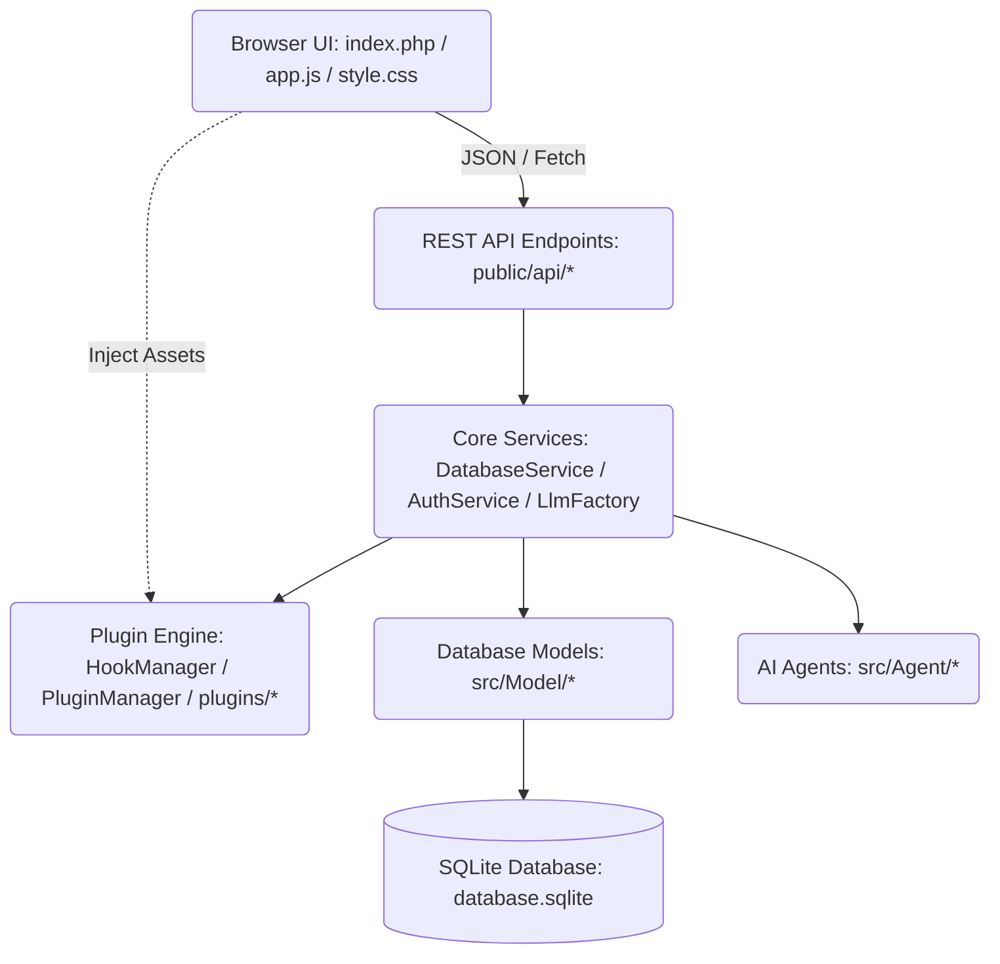

# Marketing AI Agent - Developer Documentation

This developer guide describes the codebase architecture, directory structures, extension patterns, and schema migration strategies of the **Marketing AI Agent Suite**. Use this reference when making modifications, adding new features, or updating database models.

---

## 1. Codebase Architecture

The application is built as a lightweight, single-page application (SPA) with a PHP REST API backend and a vanilla HTML/CSS/JS frontend.



### Core Technologies
- **Backend Language**: PHP 8.x (vanilla, object-oriented).
- **Frontend Language**: HTML5, Vanilla CSS3 (custom variables, dark mode/glassmorphism theme), Vanilla ES6 JavaScript.
- **Database**: SQLite 3 (via PDO).

---

## 2. Directory Structure

```
├── autoload.php                   # PSR-4 Autoloader
├── src/
│   ├── Plugin/                    # Plugin Hook Registry & Engine
│   │   ├── HookManager.php        # Action and Filter Hook dispatcher
│   │   └── PluginManager.php      # Directory scanner, loader, and manager
│   ├── Model/                     # Database Model Classes
│   │   ├── BaseModel.php          # Shared connection constructor
│   │   ├── User.php               # Users CRM table and logins
│   │   ├── Lead.php               # Prospects CRM table and qualification data
│   │   ├── Setting.php            # Global Key-Value system settings
│   │   └── ...                    # Plan, Campaign, Chat, Notification models
│   ├── Service/                   # Core business logic services
│   │   ├── DatabaseService.php    # Main database helper & model delegations
│   │   ├── AuthService.php        # Session and password authentication
│   │   └── Llm/                   # LLM factory and provider adapters
│   │       ├── LlmProviderInterface.php # Contract interface
│   │       ├── QuotaLlmProvider.php     # Limit enforcement wrapper
│   │       └── ...                      # Gemini, LM Studio, Ollama adapters
│   └── Agent/                     # AI agents orchestration
│       ├── LeadAgent.php          # Scraper & Prospect qualification pipeline
│       └── ...                    
├── plugins/                       # Directory containing all plugins
│   └── slack-notifier/            # Slack Notifier Demo Plugin
├── public/                        # Public Web Root
│   ├── index.php                  # Main HTML UI Layout & Skeletons
│   ├── app.js                     # Frontend State, Form Handlers & AJAX Toggles
│   ├── style.css                  # CSS Styling tokens and themes
│   └── api/                       # JSON REST Endpoints
│       ├── login.php              # Auth Login endpoint
│       ├── settings.php           # Admin and Public Settings loader/saver
│       ├── backup.php             # Database Backup download
│       ├── restore.php            # Safe Database Restore upload
│       ├── plugins.php            # Plugin activation/deactivation REST endpoint
│       ├── plugin-route.php       # Dynamic plugins route dispatcher
│       └── ...                    
└── database/
    └── database.sqlite            # SQLite Database File (gitignored)
```

---

## 3. Database Schema & Migration Strategy

Database tables are initialized automatically on application startup. Each model file inside `src/Model/` extends `BaseModel` and implements an `initializeSchema()` method.

### How to Add a Column or Table
To update database schemas safely without breaking existing setups:

1. **Create the Schema**: Write the `CREATE TABLE IF NOT EXISTS` statement in the model's `initializeSchema()` method:
   ```php
   public function initializeSchema(): void {
       $this->pdo->exec("CREATE TABLE IF NOT EXISTS my_new_table (
           id INTEGER PRIMARY KEY AUTOINCREMENT,
           name TEXT NOT NULL
       )");
   }
   ```
2. **Handle Migrations**: For adding columns to existing tables, wrap the `ALTER TABLE` statement in a `try-catch` block. This ensures that the migration runs once, and subsequent application startups fail silently when the column already exists:
   ```php
   try {
       $this->pdo->exec("ALTER TABLE my_existing_table ADD COLUMN postal_address TEXT");
   } catch (\PDOException $e) {
       // Column already exists, safe to ignore
   }
   ```
3. **Register the Schema**: Ensure your new model's `initializeSchema()` is called in `src/Service/DatabaseService.php::initializeSchema()`.

---

## 4. How to Add a New LLM Provider

The application wraps LLM calls behind the `LlmProviderInterface`. To add a new provider (e.g. OpenAI or Anthropic):

1. **Implement the Adapter**: Create a new class under `src/Service/Llm/` implementing the interface:
   ```php
   namespace MarketingAgent\Service\Llm;

   class OpenAIProvider implements LlmProviderInterface {
       private string $apiKey;
       private string $model;

       public function __construct(string $apiKey, string $model) {
           $this->apiKey = $apiKey;
           $this->model = $model;
       }

       public function generate(string $systemPrompt, string $userPrompt, float $temperature = 0.7): string {
           // Implement cURL request to OpenAI API
           return $generatedText;
       }
   }
   ```
2. **Register in Factory**: Modify `src/Service/Llm/LlmFactory.php` to include your new provider key:
   ```php
   switch ($provider) {
       case 'openai':
           return new OpenAIProvider($settings['openai_api_key'] ?? '', $settings['openai_model'] ?? 'gpt-4o');
       // ...
   }
   ```
3. **Update UI**: Add configuration input fields inside the settings modal in `public/index.php`, save handler logic in `public/app.js`, and whitelist the configuration keys in `public/api/settings.php`.

---

## 5. Coding & Style Guidelines

Developers must adhere to the following principles during modifications:

### Backend API Design
- **JSON Input/Output**: APIs must read request inputs via `php://input` and return consistent JSON structures:
  ```php
  $input = json_decode(file_get_contents('php://input'), true);
  echo json_encode(['success' => true, 'data' => $result]);
  ```
- **Permission Checking**: Always authenticate routes by calling `AuthService::getCurrentUser()` and verify role levels before executing actions:
  ```php
  $user = AuthService::getCurrentUser();
  if (!$user || $user['role'] !== 'admin') {
      http_response_code(403);
      echo json_encode(['success' => false, 'error' => 'Forbidden']);
      exit;
  }
  ```

### Frontend State & DOM Management
- **Central State Tracking**: Track UI selections, current active campaign, and active lead states within the global `state` object inside `public/app.js`.
- **Form Disabling**: Always disable action buttons and show loading feedback (spinners) during asynchronous requests. Re-enable them when responses return (success or error).
- **Strict Styling Tokens**: Respect the glassmorphic dark theme variables defined in `public/style.css`. Avoid hardcoded colors like solid reds/blues; instead, use variables like `var(--accent-primary)`, `var(--border-color)`, and HSL tailored shadows.

---

## 6. Pluggable Hook Architecture

The application supports modular customization through backend and frontend hook registries:
* **PHP Hook Registry**: Managed by [HookManager.php](file:///Users/shibaji/Sites/marketing-ai-agent/src/Plugin/HookManager.php). Supports registering event callbacks (`addAction`/`doAction`) and data transformations (`addFilter`/`applyFilters`).
* **JS Hook Registry**: Managed on the client via the global `window.AppHooks` utility inside `public/index.php`. Allows injecting form inputs, styling panels, and listening to tab switches.
* **Custom Routes**: Dynamic API calls can be routed to plugins via [plugin-route.php](file:///Users/shibaji/Sites/marketing-ai-agent/public/api/plugin-route.php).

For complete information on creating plugins, hooks specs, and APIs, refer to the [Plugin Development Documentation](file:///Users/shibaji/Sites/marketing-ai-agent/docs/plugin_development_documentation.md).

