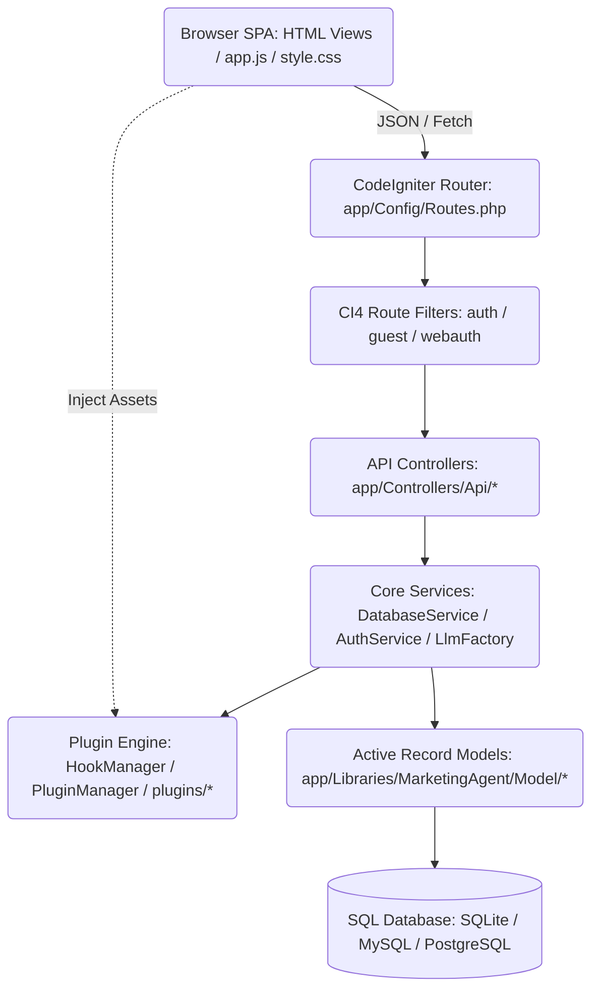

# Marketing AI Agent - Developer Documentation

This developer guide describes the codebase architecture, directory structures, extension patterns, and schema migration strategies of the **Marketing AI Agent Suite** since its modernization to the CodeIgniter 4 framework.

---

## 1. Codebase Architecture

The application uses the MVC architectural pattern powered by CodeIgniter 4 for clean routing, controller dispatching, and layout templating, connected to a premium single-page application (SPA) client interface.



### Core Technologies
- **Backend Framework**: CodeIgniter 4.x (PHP 8.x).
- **Frontend Core**: Vanilla HTML5, CSS3 Variables (supporting dark mode/glassmorphism themes), and ES6 JavaScript.
- **Database Engine**: Driver-agnostic PDO SQL (supporting SQLite, MySQL, and PostgreSQL out-of-the-box).

---

## 2. Directory Structure

```
├── app/                           # CodeIgniter 4 Application Code
│   ├── Config/                    # Framework configuration (Routes.php, Filters.php)
│   ├── Controllers/               # MVC Controllers
│   │   ├── AuthController.php     # Session page controller
│   │   ├── DashboardController.php# Main landing view controller
│   │   ├── Api/                   # JSON REST API Endpoints
│   │   │   ├── BaseApiController.php # Shared helper utilities
│   │   │   ├── AuthController.php    # Auth operations
│   │   │   ├── CampaignController.php# Campaigns operations
│   │   │   ├── LeadController.php    # Lead lists and standalone scraper
│   │   │   ├── PlanController.php    # Billing plans management
│   │   │   └── UserController.php    # CRM user records and quotas reset
│   ├── Database/                  # Migrations and Seeds
│   ├── Libraries/MarketingAgent/  # Core Domain Business Logic
│   │   ├── Model/                 # Database Active Record Models
│   │   │   ├── BaseModel.php      # Base Model bridging PDO and OrmModel
│   │   │   ├── User.php           # User records, auth logs, usage reset
│   │   │   └── Plan.php           # Duration plans, limits, seeding
│   │   ├── Service/               # Service Layer Orchestrators
│   │   │   └── DatabaseService.php# DB model facade delegations
│   │   ├── Tool/                  # Scrapers and SEO search utility tools
│   │   └── Plugin/                # Plugin Managers and Hook dispatcher
│   ├── Views/                     # HTML View Templates
│   │   ├── layout/                # Master view structures
│   │   │   ├── main.php           # Master frame template
│   │   │   └── partials/          # Header, head tags, script, settings, and modal components
│   │   └── ...                    # Page-specific content views (dashboard, campaigns, plans, users)
├── public/                        # Web Server Document Root
│   ├── app.js                     # Core Frontend State and Fetch Handler
│   ├── style.css                  # UI Design System Tokens and Variables
│   └── index.php                  # Framework front controller entry point
└── database/
    └── database.sqlite            # Local SQLite database (Git ignored)
```

---

## 3. Database Schema & Migration Strategy

Database schemas are initialized automatically. Core model schema structures inherit from [BaseModel](file:///Users/shibaji/.gemini/antigravity/scratch/marketing-ai-agent/app/Libraries/MarketingAgent/Model/BaseModel.php) which wraps a driver-agnostic [Schema](file:///Users/shibaji/.gemini/antigravity/scratch/marketing-ai-agent/app/Libraries/MarketingAgent/Database/Schema.php) helper.

### How to Modify Schemas / Add Columns

To update database schemas safely without breaking existing installs or overwriting production rows:

1. **Write Column Inits**: Write your `createTableIfNotExists()` or `addColumnIfNotExists()` call inside the model's `initializeSchema()` method. Use driver-agnostic types:
   ```php
   public function initializeSchema(): void {
       $pk = $this->schema->primaryKeyDdl();
       $vc = $this->schema->varcharDdl(255);

       $this->schema->createTableIfNotExists('my_custom_table', "
           id {$pk},
           name {$vc} NOT NULL
       ");

       // Add columns dynamically
       $this->schema->addColumnIfNotExists('my_custom_table', 'new_flag', 'INTEGER DEFAULT 0');
   }
   ```
2. **Trigger Auto-Migration**: Register the model's initialization call in `app/Libraries/MarketingAgent/Service/DatabaseService.php::initializeSchema()`:
   ```php
   // Auto-runs on every database connector initialization
   $this->myCustomModel->initializeSchema();
   ```

---

## 4. How to Add a New LLM Provider

The application wraps LLM calls behind the `LlmProviderInterface`. To add a new provider:

1. **Implement the Adapter**: Create a new class under `app/Libraries/MarketingAgent/Service/Llm/` implementing the interface:
   ```php
   namespace MarketingAgent\Service\Llm;

   class MyNewProvider implements LlmProviderInterface {
       public function generate(string $systemPrompt, string $userPrompt, float $temperature = 0.7): string {
           // Implement API logic
           return $text;
       }
   }
   ```
2. **Register in Factory**: Add the model check inside `LlmFactory::create()`:
   ```php
   switch ($provider) {
       case 'mynew':
           return new MyNewProvider($apiToken);
   }
   ```
3. **Update UI Panel**: Add fields inside the LLM Tab in [settings_modal.php](file:///Users/shibaji/.gemini/antigravity/scratch/marketing-ai-agent/app/Views/layout/partials/settings_modal.php), populate the selectors in [app.js](file:///Users/shibaji/.gemini/antigravity/scratch/marketing-ai-agent/public/app.js), and whitelist configuration keys in `SettingController.php`.

---

## 5. Coding & Style Guidelines

### Backend API Design
- **BaseApiController Extension**: API Controllers must extend [BaseApiController](file:///Users/shibaji/.gemini/antigravity/scratch/marketing-ai-agent/app/Controllers/Api/BaseApiController.php) to inherit shared methods:
  - `$this->getJsonInput()`: Decodes incoming raw JSON requests.
  - `$this->respondSuccess($data, $message)`: Uniform success formatter.
  - `$this->respondError($message, $code)`: Uniform error formatter.
- **Route Filtering**: Protect endpoints by listing them under authenticated groups inside `Routes.php` (which enforces filters like `auth` or `webauth`).

### Frontend State & DOM Management
- **Strict CSS Theme Compliance**: Respect styling tokens and custom colors (`var(--accent-primary)`, `var(--border-color)`, `var(--bg-secondary)`) defined in `style.css`.
- **Central State Management**: Always keep dropdown references, selected campaign, and active lead states within the global `state` object inside `app.js`.
- **Loading Feedback**: Toggle button disabling and spinner icons (`fa-spinner fa-spin`) during async fetch operations to provide clear user feedback.
- **Safe Date Norms**: Always use `safeParseDate()` helper in `app.js` when converting database datetime values to local display formats to prevent browser-specific parsing errors.

---

## 6. Pluggable Hook Architecture

The application supports modular customization through backend and frontend hook registries:
* **PHP Hook Registry**: Managed by [HookManager.php](file:///Users/shibaji/.gemini/antigravity/scratch/marketing-ai-agent/app/Libraries/MarketingAgent/Plugin/HookManager.php). Supports registering event callbacks (`addAction`/`doAction`) and data transformations (`addFilter`/`applyFilters`).
* **JS Hook Registry**: Managed on the client via the global `window.AppHooks` utility inside `public/app.js`.
* **Custom Routes**: Dynamic API calls can be routed to plugins via `Api\PluginRouteController`.
